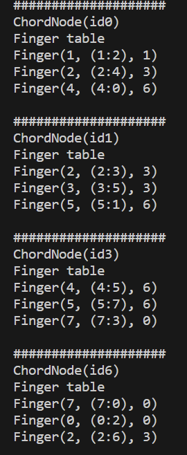
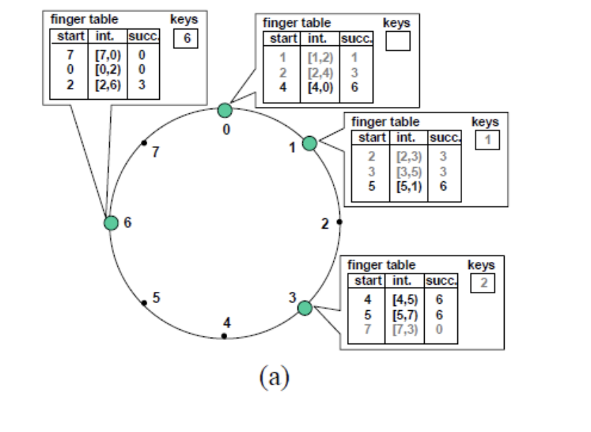
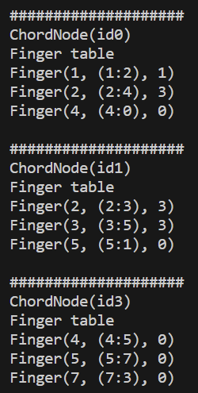
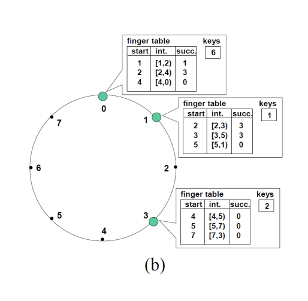

# Моделирование алгоритма Chord

## Задание

Моделирование алгоритма Chord, используемого при создании структурированных 
пиринговых сетей. Модель должна быть реализована в виде массива объектов класса 
ChordNode. Для выполнения задания требуется выполнить следующие операции:
1. Реализовать класс ChordNode, содержащий всю необходимую информацию об узле
2. Реализовать функции:
    1. Поиск по идентификатору
    2. Добавление узла
    3. Удаление узла
    4. Стабилизация системы

## Отчет
В ходе работы были реализованы все необходимые функции + стабилизация системы.

   Таблицы пальцев для узлов после добавления 4 узлов  
   (результат выполнения кода и как должно быть)
   

  
  

   Таблицы пальцев для узлов после удаления последнего узла  
   (результат выполнения кода и как должно быть)
   

  
  

